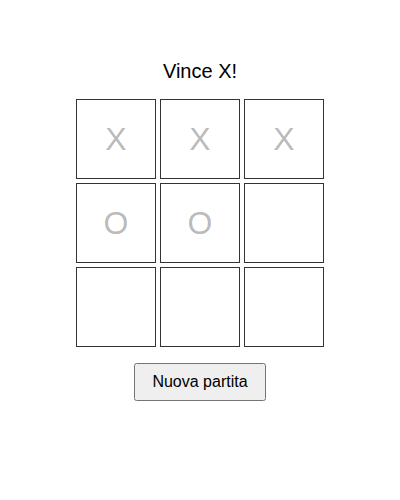

# ai-factory-tic-tac-toe

Tris (tic-tac-toe) classico, giocabile nel browser: due giocatori sullo
stesso schermo (1v1 locale) oppure una persona contro la CPU. Progetto di
vetrina per l'Officina Agenti (ai-factory), pensato per mostrare cosa un
agente costruttore riesce a fare partendo da un compito alla volta.

Per chi: chiunque voglia una partita veloce di tris nel browser, senza
installare nulla.

## Stack

- HTML, CSS, JavaScript vanilla (moduli ES nativi, nessun framework)
- Nessuna dipendenza di build: si apre direttamente il file HTML
- Test: `node --test`

## Avvio in locale

Apri `index.html` in un browser, oppure servilo con un server statico
qualsiasi, ad esempio:

```
npx serve .
```

## Test

```
node --test
```

## Stato del progetto

- `src/game.js`: logica pura del tris (board, mosse, verifica vincitore),
  senza DOM. Coperta da test in `test/game.test.js`.
- `src/app.js`: rendering del tabellone 3x3 in `#app` e gestione dei click,
  con alternanza automatica del turno tra X e O (1v1 locale). Mostra
  l'esito della partita (vittoria o pareggio), blocca le celle a partita
  conclusa e offre un pulsante "Nuova partita" per ricominciare.
- `src/ai.js`: `getCpuMove(board)` sceglie casualmente una cella libera tra
  quelle disponibili, senza modificare la board ricevuta. Coperta da test
  in `test/ai.test.js`.

Esempio di output dei test:

```
$ node --test
# tests 11
# pass 11
# fail 0
```

## Screenshot

Partita 1v1 locale, vittoria di X sulla riga in alto e pulsante
"Nuova partita" per ricominciare:


